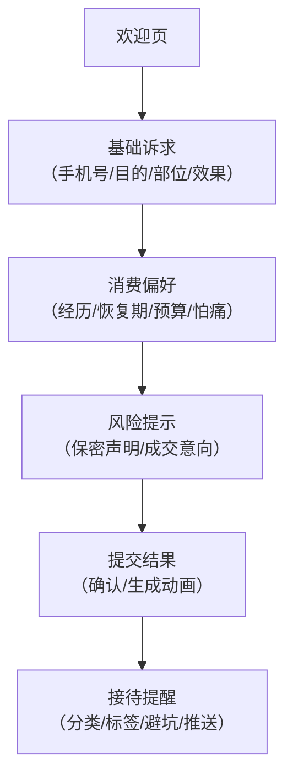

## 1. 产品概述
医美机构前台接待平板端轻量标签采集工具，用于求美者到店等待面诊时完成自助分层问卷。通过六步式问卷采集用户基础诉求、消费偏好与风险信息，自动生成接待标签并推送给对应咨询师，减少重复询问，提升新客标签化运营效率。

## 2. 核心功能

### 2.1 用户角色
| 角色 | 使用方式 | 核心权限 |
|------|----------|----------|
| 求美者 | 平板端自助操作 | 填写六步问卷、提交信息 |
| 前台/咨询师 | 结果查看端 | 查看接待标签、求美者诉求与风险提示 |

### 2.2 功能模块
1. **欢迎页**：品牌欢迎语、开始按钮、隐私说明
2. **基础诉求**：手机号核验、到店目的、关注部位、期望改善效果
3. **消费偏好**：过往医美经历、可接受恢复期、预算范围、怕痛标记
4. **风险提示**：敏感问题提示、紧急成交意向判断
5. **提交结果**：提交确认、标签生成动画
6. **接待提醒**：自动分类推荐（皮肤管理/抗衰光电/轮廓咨询）、接待标签展示、沟通避坑提示

### 2.3 页面详情
| 页面名称 | 模块名称 | 功能描述 |
|----------|----------|----------|
| 欢迎页 | 品牌欢迎 | 展示机构Logo、欢迎语、隐私政策说明 |
| 欢迎页 | 开始入口 | 「开始填写」按钮，点击进入下一步 |
| 基础诉求 | 手机号核验 | 手机号输入、验证码发送与校验（模拟） |
| 基础诉求 | 到店目的 | 单选：首次体验/定期护理/项目咨询/其他 |
| 基础诉求 | 关注部位 | 多选：面部轮廓/眼部/鼻部/皮肤状态/抗衰紧致/体型/其他 |
| 基础诉求 | 期望改善 | 多选：提亮肤色/去皱紧致/祛痘印/收缩毛孔/瘦脸/隆鼻/双眼皮/其他 |
| 消费偏好 | 过往经历 | 单选：从未做过/光电类/注射类/手术类/多种都做过 |
| 消费偏好 | 恢复期 | 单选：无需恢复期/1-3天/3-7天/1周以上/无所谓 |
| 消费偏好 | 预算范围 | 单选：5000以下/5000-1万/1-3万/3-10万/10万以上 |
| 消费偏好 | 怕痛标记 | 是/否单选，影响咨询师沟通方式 |
| 风险提示 | 敏感提示 | 告知信息仅用于面诊参考，严格保密 |
| 风险提示 | 成交意向 | 单选：今天想直接做/先了解再决定/只是初步看看 |
| 提交结果 | 提交确认 | 展示已填写摘要、确认提交按钮 |
| 提交结果 | 生成动画 | 标签生成进度动画 |
| 接待提醒 | 分类推荐 | 根据算法自动推荐：皮肤管理/抗衰光电/轮廓咨询 |
| 接待提醒 | 标签展示 | 自动生成的接待标签列表（彩色标签） |
| 接待提醒 | 避坑提示 | 需要避开的沟通点（红色高亮） |
| 接待提醒 | 推送咨询师 | 模拟推送给对应咨询师的功能 |

## 3. 核心流程
求美者从欢迎页开始，依次完成基础诉求→消费偏好→风险提示三个问卷环节，确认提交后系统自动生成接待标签，最终在接待提醒页面展示分类推荐、标签与风险信息，并推送给对应咨询师。

## 4. 用户界面设计

### 4.1 设计风格
- **主色调**：玫瑰金 #C9A27C（高端医美质感），辅助色：柔和粉 #F5E6E0、深灰 #2C2C2C
- **按钮风格**：圆角胶囊按钮，带微光渐变效果
- **字体**：标题使用优雅衬线体（Noto Serif SC），正文使用现代无衬线体（PingFang SC）
- **布局风格**：卡片式悬浮布局，平板横屏适配（1024×768以上）
- **图标风格**：线性描边图标，圆润精致
- **整体调性**：优雅、专业、温暖、私密感

### 4.2 页面设计概述
| 页面名称 | 模块名称 | UI元素 |
|----------|----------|--------|
| 欢迎页 | 品牌欢迎 | 居中Logo、大标题欢迎语、柔和渐变背景、浮动粒子装饰 |
| 基础诉求 | 表单区 | 分组卡片、圆角输入框、标签式多选、进度条指示 |
| 消费偏好 | 表单区 | 选项卡式选择、图标+文字组合、滑块式预算选择 |
| 风险提示 | 提示区 | 盾牌图标、柔和提示框、文字高亮强调 |
| 提交结果 | 确认区 | 摘要卡片列表、脉冲动画提交按钮 |
| 接待提醒 | 结果展示 | 分类徽章、彩色标签云、红色警示卡片、推送按钮 |

### 4.3 响应式
- 平板横屏优先设计（1024px+）
- 触控优化：按钮最小尺寸 48×48px，足够间距避免误触
- 支持主流平板设备（iPad、安卓平板）自适应
