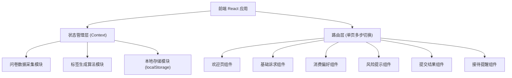
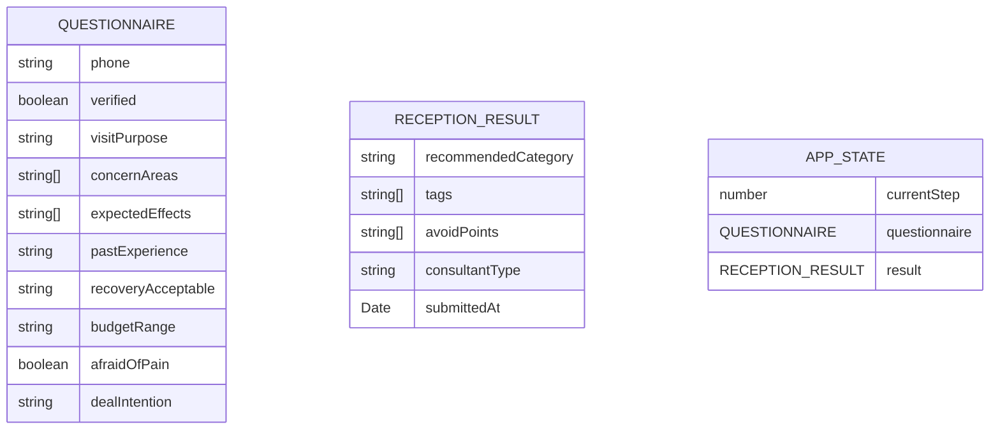

## 1. 架构设计


## 2. 技术描述
- **前端框架**: React@18 + TypeScript
- **构建工具**: Vite@5
- **样式方案**: TailwindCSS@3
- **图标库**: lucide-react（轻量级线性图标）
- **状态管理**: React Context + useReducer（轻量级，无需Redux）
- **动画库**: framer-motion（流畅的页面过渡与微交互）
- **后端**: 无（纯前端应用，数据暂存于 localStorage，模拟推送功能）
- **数据持久化**: localStorage（用于保存当前问卷进度和提交结果）

## 3. 路由定义
采用单页应用（SPA）多步表单模式，使用状态驱动的步骤切换，无需 React Router。

| 步骤标识 | 页面名称 | 对应组件 |
|----------|----------|----------|
| step-welcome | 欢迎页 | WelcomeStep |
| step-basic | 基础诉求 | BasicInfoStep |
| step-preference | 消费偏好 | PreferenceStep |
| step-risk | 风险提示 | RiskNoticeStep |
| step-submit | 提交结果 | SubmitStep |
| step-result | 接待提醒 | ReceptionResultStep |

## 4. API 定义
无后端 API，所有功能为纯前端模拟。定义以下 TypeScript 类型用于数据结构约束。

```typescript
// 用户问卷数据
interface QuestionnaireData {
  phone: string;
  verified: boolean;
  visitPurpose: string;
  concernAreas: string[];
  expectedEffects: string[];
  pastExperience: string;
  recoveryAcceptable: string;
  budgetRange: string;
  afraidOfPain: boolean;
  dealIntention: string;
}

// 接待标签
interface ReceptionTag {
  id: string;
  label: string;
  type: 'category' | 'preference' | 'warning' | 'urgency';
  color: string;
}

// 接待结果
interface ReceptionResult {
  recommendedCategory: '皮肤管理' | '抗衰光电' | '轮廓咨询';
  tags: ReceptionTag[];
  avoidPoints: string[];
  consultantType: string;
  submittedAt: Date;
}
```

## 5. 数据模型（前端状态）


## 6. 标签生成算法逻辑
基于问卷数据通过规则引擎生成接待标签：

- **分类推荐逻辑**：
  - 关注部位含"皮肤状态"或期望效果含"提亮肤色/祛痘印/收缩毛孔" → 推荐「皮肤管理」
  - 关注部位含"抗衰紧致"或期望效果含"去皱紧致" → 推荐「抗衰光电」
  - 关注部位含"面部轮廓/眼部/鼻部"或期望效果含"瘦脸/隆鼻/双眼皮" → 推荐「轮廓咨询」
  - 多项满足时按权重取最高

- **标签生成规则**：
  - 预算范围映射为消费力标签（低/中/高/极高）
  - 怕痛标记生成「痛感敏感」警示标签
  - 成交意向生成「高意向/意向一般/初步了解」标签
  - 过往经历生成「医美小白/有经验/资深求美者」标签

- **避坑提示规则**：
  - 怕痛 → "避免强调痛感明显的项目"
  - 预算低 → "避免先推高价项目，从入门项目切入"
  - 初步了解 → "避免强销售，侧重专业讲解"
  - 恢复期敏感 → "优先推荐无创/短恢复期项目"
